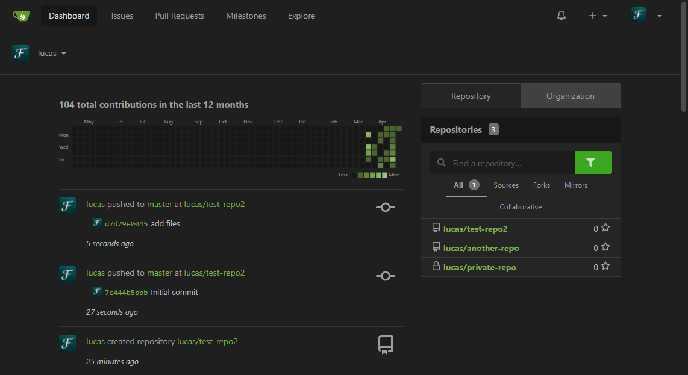

# gitea-dark-green
Based on Organizr Dark from [GilbN/theme.park](https://github.com/GilbN/theme.park), with colors from the included arc-green theme.



Place `public/css/theme-dark-green.css` in your gitea folder (Docker: $GITEA_CUSTOM). It should look like this:
```
+--- conf
|   \--- app.ini
+--- public
|   \--- css
|       \--- theme-dark-green.css
...
```

Edit/add this in your `conf/app.ini`:
```ini
[ui]
THEMES        = gitea,arc-green,dark-green
DEFAULT_THEME = gitea
```
Then your users can select this theme in their preferences (or set it as default for everyone).
